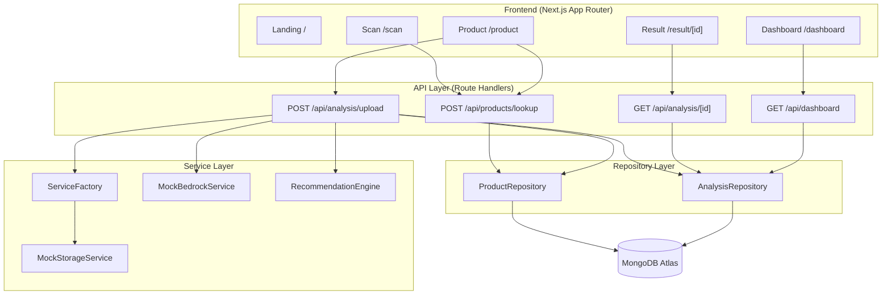
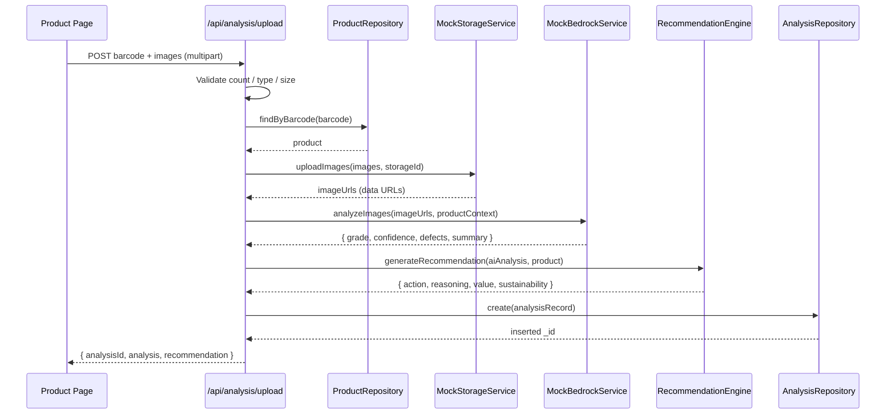

# Afora Returns Platform — Project Report

> AI-assisted returns intelligence platform that turns returned products into optimized recovery decisions. Built with Next.js (App Router), TypeScript, MongoDB Atlas, and a pluggable mock/real service architecture.

## Table of Contents

1. [Executive Summary](#1-executive-summary)
2. [Project Overview](#2-project-overview)
3. [Solution Architecture](#3-solution-architecture)
4. [Technology Stack](#4-technology-stack)
5. [Database Design](#5-database-design)
6. [API Documentation](#6-api-documentation)
7. [Frontend Pages](#7-frontend-pages)
8. [AI Analysis Workflow](#8-ai-analysis-workflow)
9. [Recommendation Engine](#9-recommendation-engine)
10. [Service Layer](#10-service-layer)
11. [Security](#11-security)
12. [Error Handling](#12-error-handling)
13. [UI/UX Design](#13-uiux-design)
14. [Performance Optimizations](#14-performance-optimizations)
15. [Testing & Verification](#15-testing--verification)
16. [Deployment Guide](#16-deployment-guide)
17. [Project Structure](#17-project-structure)
18. [Future Enhancements](#18-future-enhancements)
19. [Lessons Learned](#19-lessons-learned)
20. [Final Project Status](#20-final-project-status)

---

## 1. Executive Summary

### Problem Statement
Product returns are one of the most expensive and least optimized parts of modern e-commerce operations. When an item comes back, a warehouse worker must decide what to do with it: put it back on the shelf, sell it as open-box, send it for refurbishment, donate it, or recycle it. That decision is usually made manually, inconsistently, and under time pressure.

### Business Challenge
Every wrong disposition decision costs money. Restocking a defective item leads to a second return and an unhappy customer. Recycling a like-new product destroys recoverable value. Multiply these small mistakes across millions of returns and the financial and environmental impact becomes enormous.

### Why Return Processing Is Difficult
- **Condition is subjective.** Two workers can grade the same item differently.
- **Throughput pressure.** Workers have seconds, not minutes, per item.
- **No consistent value signal.** Workers rarely know an item's recovery economics at the moment of decision.
- **Sustainability is invisible.** The environmental cost of each disposition is not surfaced at decision time.

### Amazon HackOn Alignment
The Afora Returns Platform directly supports Amazon's circular-economy and sustainability goals by turning each return into a data-driven, defensible recovery decision. It demonstrates how AI-assisted inspection can standardize condition grading and maximize the second life of returned goods.

### Circular Economy Impact
The platform pushes every item toward its highest-value, lowest-waste outcome — restock and resale before refurbishment, refurbishment before donation, and donation before recycling. Recycling is treated as the last resort, reserved for items that are genuinely damaged beyond economical repair.

### Sustainability Benefits
Each recommendation carries an explicit **sustainability score** (0–100). High-recovery actions such as restocking score highest (95), while recycling scores lowest (30). This makes the environmental trade-off of each decision visible and comparable.

### Recovery Value Optimization
Each recommendation also carries an **estimated recovery value** expressed as a percentage of the product's original price, ranging from 95% (restock) down to 5% (recycle). Decision-makers can immediately see the financial consequence of each disposition.

### Key Outcomes
- A complete, working end-to-end workflow from barcode scan to recommendation to analytics dashboard.
- A deterministic mock AI service that allows the system to be demonstrated without any cloud credentials.
- A service-abstraction architecture that is ready to swap in real Amazon Bedrock and Amazon S3 with no changes to business logic.
- Verified TypeScript compilation, production build, and live end-to-end workflow against MongoDB Atlas.

---

## 2. Project Overview

### Purpose
Provide warehouse operators with an instant, consistent, AI-assisted recommendation for what to do with each returned product.

### Vision
A returns process where every item is graded objectively, valued transparently, and routed to its most sustainable and profitable second life.

### Goals
- Standardize condition assessment across operators.
- Surface recovery value and sustainability impact at the moment of decision.
- Persist every analysis for analytics and continuous improvement.
- Keep the architecture demo-ready (mock services) and production-ready (real AWS) simultaneously.

### Core Features
- Barcode-based product lookup against a seeded catalog.
- Multi-image capture and upload (3–5 images) with validation.
- AI condition analysis producing a grade, confidence score, and detected defects.
- A recommendation engine producing one of seven disposition actions with recovery value and sustainability score.
- A results page with a visually dominant recommendation card.
- An analytics dashboard with KPIs, action breakdown, and recent items.
- A light/dark Amazon-inspired theme that persists across sessions.

### End-to-End User Journey
```
Landing → Scan (barcode) → Product (details + image capture) → Upload & Analyze → Result (recommendation) → Dashboard
```

### Warehouse Operator Workflow
1. The operator opens the app and taps **Start Processing Returns**.
2. They enter or scan the product barcode.
3. The product details load; the operator captures 3–5 photos of the returned item.
4. They tap **Upload & Analyze**; the system stores the images, runs AI analysis, and computes a recommendation.
5. The result page shows the recommended action, recovery value, sustainability score, condition grade, confidence, and detected defects.
6. The operator can process another item or open the dashboard to review aggregate analytics.

### System Capabilities
- Persistent storage of products and analyses in MongoDB Atlas.
- Aggregated dashboard statistics computed server-side.
- Environment-driven selection between mock and real services.
- Mobile-first responsive UI optimized for handheld use in a warehouse.

---

## 3. Solution Architecture

### High-Level Architecture



### Frontend Architecture
- **App Router.** The frontend uses the Next.js App Router under `app/`. Each route is a folder with a `page.tsx`. Dynamic segments use bracket folders (`result/[id]`).
- **Page Flow.** Navigation follows Landing → Scan → Product → Result → Dashboard. The scan page forwards the barcode to the product page via a query string (`/product?barcode=...`).
- **State Management.** State is local to each page using React hooks (`useState`, `useEffect`). There is no global state library; data flows through API calls and URL parameters. The product page reads the barcode from `useSearchParams` and is wrapped in a `Suspense` boundary as required for that hook.
- **Theme System.** A `ThemeProvider` (React Context) exposes the current theme and a toggle. The selection is persisted in `localStorage` and applied by toggling the `dark` class on the document root. A shared `Header` component exposes navigation and the theme toggle.

### Backend Architecture
- **API Routes.** Four route handlers under `app/api/` implement lookup, upload, retrieval, and dashboard. They return a consistent JSON envelope (`success` plus `product` / `analysis` / `stats` / `error`).
- **Validation.** The lookup route validates input with Zod. The upload route performs explicit multipart validation (image count, MIME type, file size). The retrieval route validates the `ObjectId` format.
- **ServiceFactory.** A static factory selects the storage and AI implementations based on environment flags and memoizes the instances.
- **Repositories.** `ProductRepository` and `AnalysisRepository` encapsulate all MongoDB access, including index creation and aggregation.

### Design Patterns
- **Repository Pattern.** Database access is isolated behind repository classes, keeping route handlers free of query details and making collections easy to evolve.
- **Factory Pattern.** `ServiceFactory` centralizes the decision of which concrete service to instantiate, driven by environment configuration.
- **Service Abstraction.** Storage and AI are defined as interfaces (`IStorageService`, `IAIAnalysisService`). Business logic depends only on the interface, so a mock or real implementation can be substituted transparently.

---

## 4. Technology Stack

| Technology | Why Selected | Benefits | Role in Project |
|------------|--------------|----------|-----------------|
| **Next.js (App Router)** | Unified full-stack React framework with file-based routing and server route handlers | Single codebase for UI and API, server rendering, simple deployment | Hosts both the frontend pages and the API endpoints |
| **TypeScript** | Static typing across the whole stack | Compile-time safety, shared interfaces between frontend and backend, better refactoring | All application code; shared domain types in `lib/types` |
| **MongoDB Atlas** | Managed document database that maps naturally to nested analysis records | Flexible schema, aggregation pipeline, managed scaling and TLS | Persists products and analyses; powers dashboard statistics |
| **Tailwind CSS** | Utility-first styling with first-class dark-mode support | Fast iteration, consistent spacing, responsive utilities | All page and component styling, including the Amazon-inspired theme |
| **Zod** | Schema validation with TypeScript inference | Declarative request validation, safe parsing, clear error messages | Validates the product lookup request body |
| **React** | Component model and hooks | Declarative UI, local state via hooks, context for theming | Page composition, state, and the theme provider |
| **MockStorageService** | Demo-ready image storage without cloud dependencies | Runs offline, returns directly displayable data URLs | Stores uploaded images in memory during analysis |
| **MockBedrockService** | Deterministic, credential-free AI stand-in | Predictable demos, category-aware behavior, simulated latency | Produces condition grade, confidence, and defects |

---

## 5. Database Design

### Collections
The platform uses two collections in the `afora-returns` database (configurable via `MONGODB_DB_NAME`).

#### `products`
The seeded product catalog used for barcode lookups.

| Field | Type | Description |
|-------|------|-------------|
| `_id` | ObjectId | MongoDB identifier |
| `barcode` | string | EAN-13 style barcode (unique) |
| `productId` | string | Human-readable product id (e.g. `PROD-001`) |
| `productName` | string | Product name |
| `brand` | string | Brand name |
| `category` | string | One of: Electronics, Mobile Accessories, Home & Kitchen, Clothing, Books |
| `originalPrice` | number | Original retail price |
| `description` | string | Product description |

#### `analyses`
One record per completed analysis.

| Field | Type | Description |
|-------|------|-------------|
| `_id` | ObjectId | MongoDB identifier (used as the analysis id) |
| `barcode` | string | Barcode of the analyzed product |
| `productId` | string | Product id reference |
| `productName` | string | Denormalized product name |
| `category` | string | Denormalized category |
| `originalPrice` | number | Denormalized original price |
| `imageUrls` | string[] | Stored image URLs (data URLs in mock mode) |
| `aiAnalysis` | object | `conditionGrade`, `confidenceScore`, `defectsDetected`, `analysisSummary` |
| `recommendation` | object | `action`, `reasoning`, `estimatedValue`, `sustainabilityScore` |
| `createdAt` | Date | Timestamp set on insert |

### Schema Design
Analysis records intentionally **denormalize** key product fields (name, category, price) and embed the full `aiAnalysis` and `recommendation` objects. This makes a single read of an analysis self-contained — the result page and dashboard never need to join back to `products`.

### Index Strategy
Indexes are created programmatically by the repositories:

- **`products`**: unique index on `barcode` (fast, collision-free lookups) and a non-unique index on `category` (category analytics).
- **`analyses`**: descending index on `createdAt` (recent-items query), index on `recommendation.action` (dashboard breakdown), and index on `barcode` (per-product history).

### Relationships
The relationship between a product and its analyses is logical, expressed through the shared `barcode` / `productId` values rather than a database-level foreign key. Because analyses denormalize the fields they need, this loose coupling is sufficient for all current read paths.

### Atlas Integration
- **Connection pooling.** The client is configured with `minPoolSize: 2` and `maxPoolSize: 10`, reusing a single cached connection across requests.
- **Environment variables.** The connection string comes from `MONGODB_URI`; the database name from `MONGODB_DB_NAME` (defaulting to `afora-returns`).
- **Security considerations.** TLS is enabled, retryable writes are on, connection and socket timeouts are bounded (5s / 45s), and the URI is sanitized before logging so credentials are never written to logs.

---

## 6. API Documentation

All endpoints return a JSON envelope with a `success` boolean. Errors include a user-safe `error` message.

### POST /api/products/lookup
**Purpose.** Look up a product by barcode.

**Request.**
```json
{ "barcode": "1000000000001" }
```

**Validation.** Zod schema: `barcode` is required, 1–100 characters, matching `^[a-zA-Z0-9-_]+$`.

**Success Response (200).**
```json
{
  "success": true,
  "product": {
    "_id": "…",
    "barcode": "1000000000001",
    "productId": "PROD-001",
    "productName": "Wireless Bluetooth Headphones",
    "brand": "TechAudio",
    "category": "Electronics",
    "originalPrice": 129.99,
    "description": "Premium wireless headphones with active noise cancellation"
  }
}
```

**Error Responses.**
- `400` — invalid barcode format/length, or product not found.
- `500` — unexpected system/database error.

### POST /api/analysis/upload
**Purpose.** Upload images for a product, run AI analysis, generate a recommendation, and persist the analysis.

**Multipart Upload Flow.** The request is `multipart/form-data` containing a `barcode` field and image fields (`image0`, `image1`, …). The handler collects all `File` entries whose field name starts with `image`.

**Validation.**
- `barcode` is required.
- Image count must be between 3 and 5.
- Each image MIME type must be `image/jpeg`, `image/png`, or `image/webp`.
- Each image must be 10 MB or smaller.
- The barcode must resolve to an existing product.

**Processing.** A storage id is generated for organizing the uploaded images; images are stored via the storage service; the AI service analyzes the images with product context; the recommendation engine produces a recommendation; the complete record is inserted, and the **MongoDB `_id` of the inserted document is returned as `analysisId`**.

**Success Response (200).**
```json
{
  "success": true,
  "analysisId": "6a2f02fa0d4eb963bf8ee1dc",
  "analysis": {
    "conditionGrade": "Good",
    "confidenceScore": 84,
    "defectsDetected": ["Battery wear"],
    "analysisSummary": "Product shows good overall condition with minor wear. Identified issues: Battery wear."
  },
  "recommendation": {
    "action": "Open Box Resale",
    "reasoning": "Product is in good condition with minor cosmetic issues. Suitable for discounted open-box resale.",
    "estimatedValue": 90.99,
    "sustainabilityScore": 85
  }
}
```

**Error Responses.**
- `400` — missing barcode, invalid image count, unsupported format, oversized file, or product not found.
- `500` — image upload failure, AI analysis failure, database save failure, or unexpected error.

### GET /api/analysis/[id]
**Purpose.** Retrieve a single persisted analysis by id.

**ObjectId Validation.** The `id` path parameter is validated with `ObjectId.isValid`; invalid ids are rejected before any query runs.

**Success Response (200).**
```json
{
  "success": true,
  "analysis": {
    "_id": "6a2f02fa0d4eb963bf8ee1dc",
    "barcode": "1000000000001",
    "productName": "Wireless Bluetooth Headphones",
    "category": "Electronics",
    "originalPrice": 129.99,
    "imageUrls": ["data:image/jpeg;base64,…"],
    "aiAnalysis": { "conditionGrade": "Good", "confidenceScore": 84, "defectsDetected": ["Battery wear"], "analysisSummary": "…" },
    "recommendation": { "action": "Open Box Resale", "reasoning": "…", "estimatedValue": 90.99, "sustainabilityScore": 85 },
    "createdAt": "2026-06-15T12:00:00.000Z"
  }
}
```

**Error Responses.**
- `400` — invalid analysis id format.
- `404` — analysis not found.
- `500` — unexpected system/database error.

### GET /api/dashboard
**Purpose.** Return aggregate statistics and the most recent analyses.

**Aggregation Logic.** Statistics are computed with a MongoDB aggregation pipeline using `$facet` to compute, in one pass: the total count, the per-action breakdown (`$group` on `recommendation.action`), and the summed estimated value and average sustainability score. Recent items are the 100 most recent analyses sorted by `createdAt` descending.

**Response Format (200).**
```json
{
  "success": true,
  "stats": {
    "totalItems": 5,
    "actionBreakdown": {
      "Restock": 1, "Resell New": 0, "Open Box Resale": 2,
      "Refurbish": 1, "Manual Review": 0, "Donate": 1, "Recycle": 0
    },
    "totalEstimatedValue": 432.5,
    "averageSustainabilityScore": 78.2
  },
  "recentItems": [ { "_id": "…", "productName": "…", "recommendation": { "action": "…" }, "createdAt": "…" } ]
}
```

**Error Responses.** `500` — unexpected system/database error.

---

## 7. Frontend Pages

### Landing Page (`app/page.tsx`)
**Purpose.** Introduce the platform and route the operator into the workflow.

**Features.** Hero section with an animated status badge, a three-card value proposition (AI inspection, instant recommendations, recovery value), a four-step workflow visualization, a call-to-action section, and a footer that indicates demo mode.

**Amazon-inspired design.** Uses the Amazon orange (`#FF9900`), dark blue, and AWS blue palette with gradient hero backgrounds and full dark-mode support.

### Scan Page (`app/scan/page.tsx`)
**Barcode lookup workflow.** A single barcode input submits to `POST /api/products/lookup`. On success the page navigates to `/product?barcode=…`.

**Validation & feedback.** Empty input is blocked client-side; lookup failures and network errors render an inline error message. A loading state disables the button and shows a spinner. A hint indicates the seeded barcode range.

### Product Page (`app/product/page.tsx`)
**Product display.** Reads the barcode from the query string, fetches the product, and displays name, brand, category, barcode, and original price. Missing barcode redirects back to `/scan`.

**Image upload.** Operators add 3–5 images. The page validates count (max 5), MIME type (JPEG/PNG/WebP), and size (max 10 MB), shows thumbnail previews with per-image removal, and enforces a minimum of 3 images before enabling **Upload & Analyze**. On success it navigates to the result page.

**Mobile capture.** The file input uses `capture="environment"` to prefer the rear camera on mobile devices.

### Result Page (`app/result/[id]/page.tsx`)
**AI analysis.** Displays the condition grade as a color-coded badge, the confidence score as a progress bar, any detected defects, and the AI summary text.

**Recommendation display.** A visually dominant, gradient recommendation card is placed at the top, color-coded by action, showing the action name and reasoning.

**Recovery value & sustainability.** The recommendation card prominently shows the estimated recovery value (currency) and the sustainability score (with a progress indicator). Navigation buttons allow processing another item or opening the dashboard.

### Dashboard (`app/dashboard/page.tsx`)
**KPIs.** Executive-style cards show total items processed, total recovery value, and average sustainability score.

**Action breakdown.** A per-action list with proportional bars visualizes the distribution of dispositions.

**Recent items.** A scrollable list of recent analyses, each linking to its result page. Empty and error states are handled, and a refresh button reloads the data.

---

## 8. AI Analysis Workflow

### Upload Flow
The product page submits the barcode and images as `multipart/form-data` to the upload endpoint. The endpoint validates inputs, confirms the product exists, then orchestrates storage, AI analysis, recommendation, and persistence.

### Image Processing Flow
In mock mode, `MockStorageService` converts each `File` to a base64 data URL and stores it in an in-memory `Map`, keyed as `mock-analyses/{prefix}/image-{index}.{ext}`. It returns the data URL directly, so images render in the browser without any external fetch.

### MockBedrockService
The mock AI service is deterministic in structure but introduces controlled randomness:
- **Condition assessment.** A base confidence is chosen by category (Electronics 85, Mobile Accessories 82, Home & Kitchen 78, Clothing 75, Books 88), then adjusted by ±10.
- **Confidence score.** Clamped to 0–100 and rounded.
- **Grade mapping.** ≥90 Excellent, ≥75 Good, ≥60 Fair, ≥40 Poor, otherwise Damaged.
- **Defect detection.** Excellent items have no defects; otherwise 0–2 defects are selected from a category-specific list.
- **Latency simulation.** A 100–300 ms delay emulates a real model call.
- **Summary.** A human-readable sentence is generated from the grade and defects.

### Recommendation Generation
The AI result and product are passed to the recommendation engine, which maps confidence to a disposition action (detailed in the next section).

### Sequence Diagram



---

## 9. Recommendation Engine

The engine maps the AI confidence score to a disposition action, recovery value, and sustainability score. All recovery values are computed from the product's `originalPrice` and rounded to two decimals.

| Confidence | Action | Recovery Value | Sustainability | Notes |
|-----------|--------|----------------|----------------|-------|
| > 90 | **Restock** (Excellent) or **Resell New** | 95% | 95 | Action depends on condition grade |
| 80–90 | **Open Box Resale** | 70% | 85 | Minor cosmetic issues |
| 70–79 | **Refurbish** | 50% | 75 | Reasoning lists detected defects |
| 60–69 | **Manual Review** | 40% | 60 | Specialist inspection required |
| < 60 | **Donate** (non-damaged) or **Recycle** (Damaged) | 10% / 5% | 45 / 30 | Recycle reserved for damaged items |

### Decision Criteria
The single deciding input is the confidence score, with the condition grade acting as a tiebreaker at the extremes (Restock vs. Resell New at the top; Donate vs. Recycle at the bottom).

### Confidence Thresholds
The thresholds above are applied in descending order, so the first matching band wins. This produces a deterministic, explainable mapping from confidence to action.

### Recovery Value Estimation
Recovery value is `originalPrice × recoveryRate`, where the rate decreases as confidence (and therefore condition) decreases — from 0.95 down to 0.05.

### Sustainability Scoring
The sustainability score encodes the environmental preference order: reuse (95/85) is preferred over repair (75), repair over donation (45), and donation over recycling (30). This makes the "keep value in circulation" principle explicit in the data.

---

## 10. Service Layer

### ServiceFactory
**Purpose.** Centralize the choice of concrete storage and AI implementations and memoize them as singletons.

**Mock selection.** Storage uses the mock implementation unless `USE_MOCK_STORAGE` is exactly `"false"`; AI uses the mock unless `USE_MOCK_BEDROCK` is exactly `"false"`. This means the system defaults to safe, credential-free mock behavior.

**Environment-driven architecture.** Because selection happens behind the factory, switching to real AWS services is a configuration change, not a code change, for every caller.

### MockStorageService
**Current implementation.** Implements `IStorageService` with an in-memory `Map`. `uploadImages` converts files to base64 data URLs and stores them; `getImageUrl` retrieves a stored URL (throwing if absent); `deleteImages` removes keys. Keys follow `mock-analyses/{prefix}/image-{index}.{ext}`.

**Future S3 replacement path.** A real `S3StorageService` would implement the same `IStorageService` interface (upload via the AWS SDK, return signed URLs) and be returned by `ServiceFactory` when `USE_MOCK_STORAGE=false`. No calling code would change. The factory currently throws an explicit "not implemented" error if real storage is requested, making the seam obvious.

### MockBedrockService
**Current implementation.** Implements `IAIAnalysisService` with category-based confidence, ±10 randomness, threshold-based grade mapping, category-specific defect selection, simulated latency, and a generated summary.

**Future Bedrock replacement path.** A real `BedrockService` would implement the same `analyzeImages` interface, build a vision prompt with product context, call the model, and parse the response into the same `AIAnalysisResult` shape. As with storage, the factory throws an explicit error today when real AI is requested, marking the integration point.

---

## 11. Security

### Zod Validation
The product lookup endpoint validates its body with a Zod schema, rejecting malformed or out-of-range barcodes before any database access.

### File Validation
The upload endpoint enforces three independent checks:
- **MIME type validation.** Only `image/jpeg`, `image/png`, and `image/webp` are accepted.
- **File size validation.** Each image must be ≤ 10 MB.
- **Image count validation.** Between 3 and 5 images are required.

### ObjectId Validation
The analysis retrieval endpoint validates the id with `ObjectId.isValid` and returns `400` for malformed ids, preventing invalid queries.

### Security Headers
`next.config.ts` applies headers to all routes: a Content-Security-Policy, `X-Frame-Options: SAMEORIGIN`, `X-Content-Type-Options: nosniff`, `Referrer-Policy: strict-origin-when-cross-origin`, `X-DNS-Prefetch-Control`, and a `Permissions-Policy` that allows the camera for same-origin use while disabling microphone and geolocation. The CSP permits `data:` and `blob:` images to support mock data URLs and local previews.

### Environment Variables
Configuration is supplied via environment variables (`MONGODB_URI`, `MONGODB_DB_NAME`, `USE_MOCK_STORAGE`, `USE_MOCK_BEDROCK`). A validation helper (`lib/env.ts`) checks for required variables and reports only variable **names**, never values.

### NoSQL Injection Protection
All queries use the MongoDB driver's parameterized methods (`findOne`, `insertOne`, aggregation) with validated inputs. There is no string concatenation in query construction, which prevents NoSQL injection.

### Error Sanitization
API handlers log technical details server-side but return generic, user-safe messages (e.g. "A system error occurred. Please try again."). The connection manager sanitizes the MongoDB URI before logging so credentials never appear in logs.

---

## 12. Error Handling

### API Error Handling
Every route is wrapped in try/catch and returns the correct HTTP status with a safe message. Validation failures return `400`, missing analyses `404`, and unexpected failures `500`.

### Frontend Error Handling
Each page handles failed fetches by setting an error state and rendering a friendly error card with a recovery action (e.g. "Try Again" or "Retry"). App-level boundaries — `app/error.tsx`, `app/global-error.tsx`, and `app/not-found.tsx` — catch rendering errors and unknown routes.

### Loading States
The scan, product, result, and dashboard pages each render spinners or disabled controls while requests are in flight.

### Empty States
The dashboard renders a dedicated empty state when no items have been processed, guiding the operator to process their first item.

### Retry Paths
Error cards expose explicit retry or navigation actions so the operator is never stuck.

### User Feedback Messages
Messages are specific and actionable: network errors, "Product not found", per-image validation errors, and a generic system-error fallback.

### HTTP Status Codes
`200` success, `400` validation/not-found-on-lookup, `404` analysis not found, `500` system errors — applied consistently across endpoints.

---

## 13. UI/UX Design

### Amazon-Inspired Theme
The interface uses an Amazon-inspired palette centered on Amazon orange, with dark blue and AWS blue accents, applied through Tailwind utilities and CSS variables.

### Color Palette
- Primary Orange `#FF9900`
- Dark Blue `#232F3E`
- Background Dark `#131A22`
- AWS Blue `#146EB4`

### Dark Mode / Light Mode
Both themes are fully supported via Tailwind's `dark:` variants. The `ThemeProvider` toggles the `dark` class on the document root, and every page provides dark-mode styling for surfaces, text, borders, and accents.

### Theme Persistence
The selected theme is stored in `localStorage` and restored on load, so an operator's preference survives navigation and page reloads.

### Mobile-First Design
Layouts are designed for handheld use first — full-width content with comfortable padding on small screens, constrained and centered on larger screens — suiting warehouse operators on mobile devices.

### Responsive Layout
Tailwind responsive utilities adapt grids and spacing across breakpoints (for example, KPI cards and value-proposition cards reflow from stacked to multi-column).

### Accessibility Considerations
Interactive controls include `aria-label`s (theme toggle, image removal), buttons have clear disabled states, and color-coded badges are paired with text labels so meaning is not conveyed by color alone.

### User Journey
The visual hierarchy guides the operator: a prominent primary action on each page, a dominant recommendation card on the result page, and a consistent header for navigation and theming throughout.

---

## 14. Performance Optimizations

### Connection Pooling
A single MongoDB client with a 2–10 connection pool is cached and reused across requests, avoiding per-request connection overhead.

### Repository Abstraction
Centralizing queries in repositories enables consistent, optimized access patterns and a single place to manage indexes.

### Efficient Queries
Lookups use indexed fields (`barcode`), and recent-items queries use the descending `createdAt` index with a bounded `limit`.

### Aggregation Usage
Dashboard statistics are computed in a single `$facet` aggregation rather than multiple round trips or in-application loops, minimizing data transfer and compute.

### Build Optimizations
The production build compiles cleanly and statically prerenders the pages that can be static (landing, scan, product, dashboard) while serving dynamic routes (`result/[id]` and the API routes) on demand.

### Next.js Optimization
The App Router enables route-level code organization and server route handlers in the same project, and the shared layout loads the theme provider once for all pages.

---

## 15. Testing & Verification

This section reflects only verification that was actually performed.

### TypeScript Verification
`npx tsc --noEmit` completes with no type errors.

### Build Verification
`npm run build` completes successfully, producing the full route table (landing, scan, product, dashboard as static; `result/[id]` and the four API routes as dynamic).

### End-to-End Workflow Verification
A live run against the development server exercised the full workflow: product lookup `200`, image upload `200`, analysis retrieval `200` with the returned `analysisId` matching the stored document `_id`, and dashboard `200`. Negative paths returned the expected statuses: invalid lookup input `400` and malformed analysis id `400`.

### MongoDB Atlas Verification
Database initialization connected to Atlas, created the `products` and `analyses` collections, created all indexes, seeded 50 products, and confirmed barcode `1000000000001` resolves to a product. Both repositories were confirmed to read and aggregate against Atlas.

### API Verification
All four endpoints returned the documented success and error envelopes during the end-to-end run, and security headers (including CSP and `X-Frame-Options`) were present on responses.

### Result Retrieval Verification
The upload→result linkage was specifically verified: the analysis id returned by the upload endpoint is the authoritative MongoDB `_id`, and the retrieval endpoint successfully returns that document.

---

## 16. Deployment Guide

### Prerequisites
- Node.js 20+ (developed and verified on Node 22).
- A MongoDB Atlas cluster and connection string.

### Environment Variables
Create `.env.local` (see `.env.example`):
```
MONGODB_URI=mongodb+srv://<user>:<password>@<cluster>/?retryWrites=true&w=majority
MONGODB_DB_NAME=afora-returns
USE_MOCK_STORAGE=true
USE_MOCK_BEDROCK=true
```
> If a credential contains reserved characters (for example `@`), percent-encode it (`@` → `%40`) so the URI parses correctly.

### MongoDB Atlas Setup
1. Create a cluster and a database user.
2. Allow your IP (or appropriate access) in the network access list.
3. Copy the SRV connection string into `MONGODB_URI`.
4. Run the initialization script to create indexes and seed products.

### Local Development Setup
1. `npm install`
2. Create `.env.local` as above.
3. Initialize the database (indexes + seed).
4. `npm run dev` and open the local URL.

### Production Deployment Steps
1. Provide the same environment variables in the hosting platform.
2. Run `npm run build`.
3. Run `npm run start` (or deploy to a Next.js-compatible host).
4. Keep `USE_MOCK_STORAGE` / `USE_MOCK_BEDROCK` as `true` for demo, or set to `false` once real AWS services are implemented and configured.

### Troubleshooting
- **`querySrv ENOTFOUND` / connection failures.** Verify the SRV host and percent-encode special characters in credentials.
- **Missing variable errors.** Ensure `MONGODB_URI` is present; the env helper reports missing names.
- **"Real … service not implemented".** This is expected when `USE_MOCK_*` is set to `false` in this build; set it back to `true` or implement the real service.

---

## 17. Project Structure

```
afora-app/
├── app/                      # Next.js App Router (pages + API)
│   ├── api/
│   │   ├── products/lookup/route.ts     # POST product lookup
│   │   ├── analysis/upload/route.ts     # POST image upload + analysis
│   │   ├── analysis/[id]/route.ts       # GET analysis by id
│   │   └── dashboard/route.ts           # GET dashboard stats
│   ├── scan/page.tsx          # Barcode entry
│   ├── product/page.tsx       # Product details + image capture
│   ├── result/[id]/page.tsx   # Analysis result
│   ├── dashboard/page.tsx     # Analytics dashboard
│   ├── page.tsx               # Landing page
│   ├── layout.tsx             # Root layout + ThemeProvider
│   ├── error.tsx              # Route error boundary
│   ├── global-error.tsx       # Global error boundary
│   ├── not-found.tsx          # 404 page
│   └── globals.css            # Theme variables + utilities
├── components/
│   ├── Header.tsx             # Navigation + theme toggle
│   └── ThemeProvider.tsx      # Theme context + persistence
├── lib/
│   ├── db/
│   │   ├── connection.ts      # Pooled MongoDB connection
│   │   ├── init.ts            # Index creation + idempotent seeding
│   │   ├── seed.ts            # 50-product catalog generator
│   │   └── repositories/      # ProductRepository, AnalysisRepository
│   ├── services/
│   │   ├── ServiceFactory.ts  # Mock/real selection
│   │   ├── storage/           # IStorageService + MockStorageService
│   │   ├── ai/                # IAIAnalysisService + MockBedrockService
│   │   └── RecommendationEngine.ts
│   ├── types/index.ts         # Shared domain types
│   ├── env.ts                 # Environment validation
│   └── index.ts               # Central library exports
├── scripts/                   # Backend/init utility scripts
├── .kiro/specs/               # Requirements, design, and tasks
├── next.config.ts             # Security headers
└── .env.example               # Configuration template
```

**Major folder purposes.**
- `app/` — all UI pages and API route handlers.
- `app/api/` — the four backend endpoints.
- `components/` — reusable UI (header and theme provider).
- `lib/repositories/` (under `lib/db/`) — MongoDB data access.
- `lib/services/` — storage, AI, recommendation logic, and the factory.
- `lib/types/` — shared TypeScript domain types.
- `scripts/` — initialization and backend validation utilities.
- `.kiro/specs/` — the requirements, design, and task plan that guided implementation.

---

## 18. Future Enhancements

> The following are future work, not currently implemented.

- **Real Amazon Bedrock integration** — a `BedrockService` implementing `IAIAnalysisService` for genuine vision-based condition assessment.
- **Amazon S3 integration** — an `S3StorageService` implementing `IStorageService` with signed URLs.
- **Live barcode scanning** — camera-based scanning to replace manual barcode entry.
- **Advanced vision models** — defect localization and severity scoring beyond category-based heuristics.
- **Seller dashboard** — seller-facing views and disposition history.
- **Analytics expansion** — trend analysis, category-level recovery reporting, and time-series dashboards.
- **Automated test suites** — the optional unit and integration tests defined in the plan.

---

## 19. Lessons Learned

### Technical Learnings
Returning the database-generated identifier (rather than a separately generated one) is essential for a reliable create→read flow; aligning the upload response id with the stored `_id` removed an entire class of retrieval failures. Percent-encoding credentials in connection strings is a small but critical detail for Atlas connectivity.

### Architecture Learnings
Defining storage and AI as interfaces behind a factory paid off immediately: the entire application runs in a credential-free demo mode while remaining one configuration flag away from real AWS services. Denormalizing read-critical fields into the analysis record kept the result and dashboard reads simple and fast.

### Product Learnings
Surfacing both recovery value and sustainability score at the moment of decision turns an abstract "what do I do with this?" into a concrete, comparable trade-off — which is exactly what a time-pressured operator needs.

### Hackathon Learnings
A deterministic mock of the AI layer makes the solution reliably demonstrable without external dependencies, which is invaluable under hackathon conditions. Verifying TypeScript, the production build, and a live end-to-end run provides credible, reproducible evidence of completeness.

---

## 20. Final Project Status

### Tasks Completed
All planned implementation tasks (1–19) are complete: project setup, database and repositories, seed data, storage and AI service abstractions, recommendation engine, all API routes, all frontend pages, responsive/theme work, error handling, security measures, and final integration verification.

### APIs Implemented
- `POST /api/products/lookup`
- `POST /api/analysis/upload`
- `GET /api/analysis/[id]`
- `GET /api/dashboard`

### Pages Implemented
Landing, Scan, Product, Result (`/result/[id]`), and Dashboard, plus error and not-found boundaries.

### Services Implemented
`ServiceFactory`, `MockStorageService` (with `IStorageService`), `MockBedrockService` (with `IAIAnalysisService`), and `RecommendationEngine`.

### Database Status
MongoDB Atlas connected; `products` and `analyses` collections created; all indexes created; 50 products seeded; lookups, inserts, retrievals, and aggregation verified.

### Verification Status
TypeScript: pass. Production build: pass. End-to-end workflow: pass. Atlas initialization and verification: pass.

### Known Limitations
- Real S3 and Bedrock paths are interface-ready but only mock implementations are present; requesting real services raises an explicit not-implemented error.
- Barcode entry is manual (no live camera scanning yet).
- The optional automated test suites are not implemented.

### Production Readiness Assessment
The platform is production-ready for demonstration and pilot use in mock mode: it is type-safe, builds cleanly, persists to a managed database, applies security headers and input validation, and handles errors gracefully. Moving to full production primarily requires implementing the real AWS service classes behind the existing interfaces and adding automated test coverage.

### Final Conclusion
The Afora Returns Platform delivers a complete, working, end-to-end returns-intelligence workflow that standardizes condition assessment and optimizes each item for recovery value and sustainability. Its interface-driven service architecture cleanly separates demo and production concerns, positioning it to adopt real Amazon Bedrock and S3 with minimal change while already demonstrating tangible circular-economy value today.
