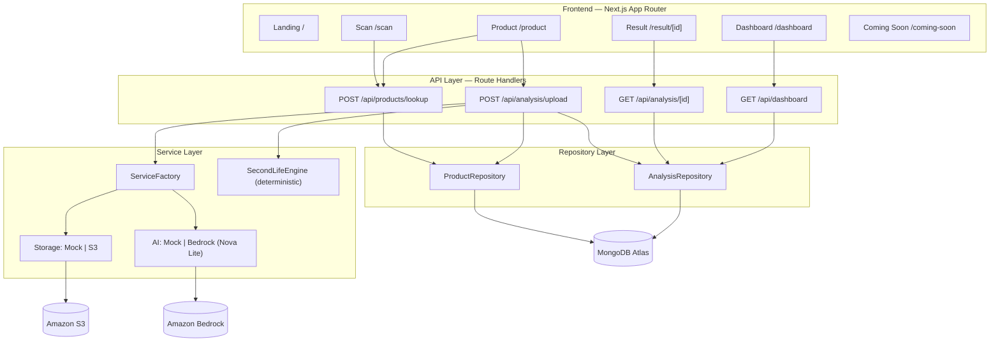

# Afora Returns — AI-Powered Returns & Second-Life Decision Engine

Afora Returns turns the messy, manual problem of e-commerce product returns into a fast, data-driven decision. A warehouse operator scans a returned item, captures photos, and the platform uses Amazon Bedrock (Nova Lite) vision AI to validate the product and inspect its condition. A deterministic decision engine then computes **every possible "second life" path** — restock, open-box resale, refurbish, liquidate, donate, recycle — with cost, revenue, profit, ROI, and sustainability for each, and highlights the single best recommendation.

> Built for the Amazon HackOn theme of sustainable, circular-economy returns processing.

LIVE WORKING LINK  : https://afora-sap.vercel.app/
<br>
DEMO YOUTUBE LINK : https://www.youtube.com/watch?v=O1hqdpXeV_c

---

## Table of Contents

1. [Key Features](#key-features)
2. [Tech Stack](#tech-stack)
3. [System Architecture](#system-architecture)
4. [End-to-End Workflow](#end-to-end-workflow)
5. [Project Structure](#project-structure)
6. [Data Model](#data-model)
7. [API Reference](#api-reference)
8. [Service Layer & Design Patterns](#service-layer--design-patterns)
9. [Second-Life Decision Engine](#second-life-decision-engine)
10. [Bedrock AI Integration](#bedrock-ai-integration)
11. [Frontend Pages](#frontend-pages)
12. [Theming (Light/Dark)](#theming-lightdark)
13. [Environment Variables](#environment-variables)
14. [Getting Started](#getting-started)
15. [Scripts](#scripts)
16. [Running Modes: Mock vs. Real AWS](#running-modes-mock-vs-real-aws)
17. [Deployment](#deployment)
18. [Security](#security)
19. [Roadmap](#roadmap)
20. [Troubleshooting](#troubleshooting)

---

## Key Features

- **Barcode lookup** against a seeded product catalog (50 products, 5 categories).
- **Original product reference images** displayed for visual comparison.
- **Multi-image capture & upload** (3–5 images) with format/size validation and mobile camera support.
- **AI product-match validation** — rejects returns where the item does not match the reference product (wrong-product detection).
- **AI visual inspection** — detects scratches, dents, cracks, missing parts/accessories, packaging damage, dirt, water damage, and functional risk.
- **Second-Life Decision Engine** — computes all six next-life paths with cost / revenue / profit / ROI / sustainability / confidence, plus a multi-factor best recommendation.
- **Comparison dashboard** — per-decision comparison table and charts so operations managers can weigh every option.
- **Analytics dashboard** — KPIs, action breakdown, wrong-product rate, recent items.
- **Pluggable services** — mock (offline/demo) or real AWS (S3 + Bedrock) via environment flags.
- **Light/Dark theme** — warm, Amazon-inspired palette with persisted preference.

---

## Tech Stack

| Layer | Technology | Why |
|-------|------------|-----|
| Framework | **Next.js 16 (App Router, Turbopack)** | Unified full-stack React: pages + API route handlers in one deployable app |
| Language | **TypeScript (strict)** | End-to-end type safety; shared domain types between client and server |
| UI | **React 19 + Tailwind CSS v4** | Component model + utility-first styling with first-class dark mode |
| Database | **MongoDB Atlas (Node driver v7)** | Flexible document model for nested analyses; aggregation pipeline for stats |
| Object storage | **Amazon S3** (`@aws-sdk/client-s3`, `s3-request-presigner`) | Durable image storage with presigned URLs |
| AI / Vision | **Amazon Bedrock — Nova Lite** (`@aws-sdk/client-bedrock-runtime`, Converse API) | Multimodal product-match + condition inspection |
| Validation | **Zod** | Declarative, type-inferred request validation |
| Runtime | **Node.js 20+ (developed on 22)** | Native `fetch`, `File`, `--env-file` support |

---

## System Architecture



**Design principle:** the AI does perception (match + inspection); a deterministic engine does the money math. This keeps financial figures auditable and reproducible rather than hallucinated by an LLM.

---

## End-to-End Workflow

1. **Scan** — operator enters/scans a barcode → `POST /api/products/lookup` resolves the product from MongoDB.
2. **Product** — product details + reference image shown; operator captures 3–5 photos.
3. **Upload** — `POST /api/analysis/upload` (multipart):
   - validates barcode + image count/type/size,
   - uploads images via the Storage service (S3 or mock),
   - runs **AI inspection** (product match + visual inspection),
   - if similarity `< 60` → flags **wrong product** and routes to manual review,
   - otherwise runs the **Second-Life Decision Engine** to compute all paths + best,
   - persists the full analysis to MongoDB and returns the authoritative `_id`.
4. **Result** — `/result/[id]` shows the best next life, comparison table, charts, cost/market breakdown.
5. **Dashboard** — `/dashboard` aggregates KPIs, action breakdown, and wrong-product rate.

---

## Project Structure

```
afora-app/
├── app/                          # Next.js App Router (pages + API)
│   ├── api/
│   │   ├── products/lookup/route.ts   # POST barcode → product
│   │   ├── analysis/upload/route.ts   # POST images → AI + decision + persist
│   │   ├── analysis/[id]/route.ts     # GET analysis by id
│   │   └── dashboard/route.ts         # GET aggregate stats
│   ├── scan/page.tsx              # Barcode entry
│   ├── product/page.tsx           # Product details + reference image + upload
│   ├── result/[id]/page.tsx       # Second-Life decision view
│   ├── dashboard/page.tsx         # Analytics
│   ├── coming-soon/page.tsx       # Product roadmap (UI only)
│   ├── page.tsx                   # Landing
│   ├── layout.tsx                 # Root layout + ThemeProvider
│   ├── error.tsx / global-error.tsx / not-found.tsx
│   └── globals.css                # Theme tokens (warm light + dark)
├── components/
│   ├── Header.tsx                 # Nav + theme toggle
│   └── ThemeProvider.tsx          # Theme context + localStorage persistence
├── lib/
│   ├── db/
│   │   ├── connection.ts          # Pooled MongoDB client (TLS, retry, sanitized logs)
│   │   ├── init.ts                # Index creation + idempotent seeding
│   │   ├── seed.ts                # 50-product catalog + image path helper
│   │   └── repositories/          # ProductRepository, AnalysisRepository
│   ├── services/
│   │   ├── ServiceFactory.ts      # Mock vs. real selection (env-driven)
│   │   ├── SecondLifeEngine.ts    # Deterministic cost/market/paths/best
│   │   ├── storage/               # IStorageService, MockStorageService, S3StorageService
│   │   └── ai/                    # IAIAnalysisService, MockBedrockService, BedrockService
│   ├── types/index.ts             # Shared domain types
│   ├── env.ts                     # Env validation helper
│   └── index.ts                   # Central exports
├── scripts/                       # init-db, seed-reference-images, validate-* utilities
├── public/reference-images/       # Product reference images (jpeg + generated svg)
├── next.config.ts                 # Security headers (CSP, X-Frame-Options, ...)
└── .env.example                   # Configuration template
```

---

## Data Model

Two MongoDB collections in database `afora-returns`.

### `products`
| Field | Type | Notes |
|-------|------|-------|
| `_id` | ObjectId | |
| `barcode` | string | unique index |
| `productId` | string | e.g. `PROD-001` |
| `productName`, `brand`, `description` | string | |
| `category` | enum | Electronics, Mobile Accessories, Home & Kitchen, Clothing, Books (indexed) |
| `originalPrice` | number | USD |
| `originalImageUrl` | string | `/reference-images/pid_{NNN}.jpeg` (canonical reference image) |

### `analyses`
| Field | Type | Notes |
|-------|------|-------|
| `_id` | ObjectId | used as the analysis id returned to the client |
| `barcode`, `productId`, `productName`, `category` | — | denormalized for self-contained reads |
| `originalPrice` | number | |
| `imageUrls` | string[] | uploaded returned-image URLs |
| `aiAnalysis` | object | `conditionGrade`, `confidenceScore`, `defectsDetected[]`, `analysisSummary` (legacy/back-compat) |
| `recommendation` | object | `action`, `reasoning`, `estimatedValue`, `sustainabilityScore` (legacy/back-compat) |
| `productMatch` | object | `isSameProduct`, `similarityScore`, `confidence`, `reason` |
| `visualInspection` | object | `condition`, `damageSeverity`, `confidence`, `issues[]` |
| `costEstimate` | object | cleaning/repair/replacement/packaging/labor/logistics/total |
| `marketValue` | object | current/refurbished/openBox/liquidation/donation/recycling/scrap |
| `nextLifeOptions` | array | all 6 paths with cost/revenue/profit/ROI/sustainability/confidence/feasible |
| `bestRecommendation` | object | best path + multi-factor score breakdown |
| `wrongProduct` | boolean | true if product-match rejected |
| `createdAt` | Date | descending index |

**Indexes:** `products` → `barcode` (unique), `category`. `analyses` → `createdAt` (desc), `recommendation.action`, `barcode`. Dashboard stats use a single `$facet` aggregation.

---

## API Reference

### `POST /api/products/lookup`
Body: `{ "barcode": "1000000000001" }` (Zod-validated). Returns `{ success, product }` (200) or `{ success:false, error }` (400 not found / invalid, 500 system).

### `POST /api/analysis/upload`
`multipart/form-data`: `barcode` + `image0..imageN` (3–5 images, JPEG/PNG/WebP, ≤10MB each).
Returns `{ success, analysisId, wrongProduct, productMatch, visualInspection, analysis, recommendation, costEstimate?, marketValue?, nextLifeOptions?, bestRecommendation? }`.

### `GET /api/analysis/[id]`
Validates ObjectId. Returns `{ success, analysis }` (200), 404 if not found, 400 if malformed id.

### `GET /api/dashboard`
Returns `{ success, stats, recentItems }` where `stats` includes `totalItems`, `actionBreakdown`, `totalEstimatedValue`, `averageSustainabilityScore`, `wrongProductCount`.

---

## Service Layer & Design Patterns

- **Repository Pattern** — `ProductRepository` / `AnalysisRepository` encapsulate all MongoDB access (queries, indexes, aggregation), keeping route handlers thin.
- **Factory Pattern** — `ServiceFactory` selects the concrete Storage and AI implementations from environment flags and memoizes them as singletons.
- **Service Abstraction** — Storage and AI are interfaces (`IStorageService`, `IAIAnalysisService`); business logic depends only on the interface, so mock and real implementations are interchangeable with zero caller changes.

| Capability | Interface | Mock (offline/demo) | Real (production) |
|-----------|-----------|---------------------|-------------------|
| Image storage | `IStorageService` | `MockStorageService` (in-memory base64 data URLs) | `S3StorageService` (PutObject + presigned GET URLs) |
| AI inspection | `IAIAnalysisService` | `MockBedrockService` (deterministic) | `BedrockService` (Nova Lite, Converse API) |

Selection flags: `USE_MOCK_STORAGE` and `USE_MOCK_BEDROCK` (default to mock unless set to exactly `"false"`).

---

## Second-Life Decision Engine

`lib/services/SecondLifeEngine.ts` — pure, deterministic, no randomness.

- **Phase 3 — Cost estimate:** cleaning, repair (scaled by damage severity), replacement (if missing parts), packaging, labor, logistics → total refurbishment cost.
- **Phase 4 — Market value:** current (new), refurbished, open-box, liquidation, donation (tax-equivalent), recycling, scrap — derived from original price × condition multiplier.
- **Phase 5 — All paths:** Restock as New, Open Box Resale, Refurbish & Resell, Liquidation, Donate, Recycle. Each gets `requiredCost`, `expectedSellingPrice`, `expectedProfit`, `roiPercentage`, `confidenceScore`, `sustainabilityScore`, and a `feasible` flag based on condition/severity/match.
- **Phase 6 — Best selection:** weighted combined score = profit 35% + sustainability 25% + risk 15% + customer-satisfaction 15% + operational-simplicity 10%, chosen among feasible paths.

The engine also projects legacy `aiAnalysis` + `recommendation` so older records and the dashboard aggregation keep working.

---

## Bedrock AI Integration

`lib/services/ai/BedrockService.ts` uses the **Converse API** with multimodal input:

- Loads the reference image (from `/public`, S3 URL, or data URL; SVG references are skipped since the model needs raster formats) and the returned images.
- Sends a strict-JSON prompt asking for **product match** (`isSameProduct`, `similarityScore`, `confidence`, `reason`) and **visual inspection** (`condition`, `damageSeverity`, `confidence`, `issues[]`).
- Robust parsing: strips markdown fences, extracts the JSON object, validates/coerces enums, clamps scores, and falls back to safe defaults on malformed/empty responses.
- Structured logging: `[Bedrock] Service initialized | Starting analysis | Invoking model ... | Response received | Analysis completed | Error`.

Default model: `amazon.nova-lite-v1:0` (override with `BEDROCK_MODEL_ID`). Region from `AWS_REGION` (e.g. `ap-south-1`).

---

## Frontend Pages

| Route | Purpose |
|-------|---------|
| `/` | Landing — hero, value props, workflow, CTA |
| `/scan` | Barcode entry with validation + loading/error states |
| `/product` | Product details, reference image, 3–5 image capture/upload |
| `/result/[id]` | Best Next Life card, product match, visual inspection, comparison table + charts, cost/market breakdown |
| `/dashboard` | KPIs (total, recovery value, sustainability, wrong-product rate), action breakdown, recent items |
| `/coming-soon` | Product roadmap (UI only) |

---

## Theming (Light/Dark)

- `ThemeProvider` (React Context) toggles the `dark` class on `<html>` and persists the choice in `localStorage`; default is light.
- Toggle lives in the `Header` on every page.
- Palette is a **warm, Amazon-inspired** tone: light surfaces use warm "paper" neutrals (`gray-50`/`gray-100` overridden in `globals.css`), dark mode uses Amazon navy (`amazon-dark` `#232F3E`, `amazon-bg` `#131A22`), accent Amazon orange `#FF9900`, secondary AWS blue `#146EB4`.

---

## Environment Variables

Create `.env.local` (see `.env.example`):

```bash
# MongoDB
MONGODB_URI=mongodb+srv://<user>:<password>@<cluster>/?retryWrites=true&w=majority
MONGODB_DB_NAME=afora-returns

# Service selection ("true" = mock/offline, "false" = real AWS)
USE_MOCK_STORAGE=false
USE_MOCK_BEDROCK=false

# AWS (required when USE_MOCK_STORAGE=false)
AWS_REGION=ap-south-1
AWS_ACCESS_KEY_ID=your_access_key
AWS_SECRET_ACCESS_KEY=your_secret_key
S3_BUCKET_NAME=afora-returns-images-2026

# Bedrock (required when USE_MOCK_BEDROCK=false)
BEDROCK_MODEL_ID=amazon.nova-lite-v1:0
```

> If a credential contains reserved URI characters (e.g. `@`), percent-encode them (`@` → `%40`) in `MONGODB_URI`.

---

## Getting Started

```bash
# 1. Install dependencies
npm install

# 2. Configure environment
#    create .env.local from .env.example and fill in values

# 3. Initialize the database (creates indexes + seeds 50 products)
npx tsx scripts/init-db.ts

# 4. (Optional) generate/seed reference images
npx tsx scripts/seed-reference-images.ts

# 5. Run the dev server
npm run dev          # http://localhost:3000

# 6. Production build
npm run build
npm run start
```

Prerequisites: Node.js 20+ (developed on 22), a MongoDB Atlas cluster, and — for real mode — an AWS account with S3 + Bedrock (Nova Lite model access enabled in your region).

---

## Scripts

| Command | Description |
|---------|-------------|
| `npm run dev` | Start the Next.js dev server (Turbopack) |
| `npm run build` | Production build |
| `npm run start` | Serve the production build |
| `npm run lint` | ESLint |
| `npx tsx scripts/init-db.ts` | Connect, create indexes, seed 50 products, verify |
| `npx tsx scripts/seed-reference-images.ts` | Match/generate reference images + backfill `originalImageUrl` |
| `npx tsx scripts/validate-reference-images.ts` | Validate every product has a working reference image |
| `npx tsx scripts/validate-backend.ts` | Backend service validation checks |

---

## Running Modes: Mock vs. Real AWS

The platform runs end-to-end in two modes, switched purely by env flags — no code changes:

- **Demo / offline (mock):** `USE_MOCK_STORAGE=true`, `USE_MOCK_BEDROCK=true`. Images are stored as in-memory base64 data URLs; AI uses deterministic category-based logic. No AWS credentials needed. Ideal for local dev and reliable demos.
- **Production (real AWS):** `USE_MOCK_STORAGE=false`, `USE_MOCK_BEDROCK=false`. Images upload to S3 (private, presigned URLs); AI uses Amazon Bedrock Nova Lite for product match + visual inspection.

MongoDB Atlas is used in both modes.

---

## Deployment

1. Provision MongoDB Atlas; allow your deployment's network access; copy the SRV URI into `MONGODB_URI`.
2. For real mode: create the S3 bucket, an IAM user/role with `s3:PutObject/GetObject/DeleteObject` and `bedrock:InvokeModel`, and enable Nova Lite model access in the chosen region.
3. Set all environment variables in your host (e.g. Vercel project settings or AWS Amplify/App Runner).
4. `npm run build` then `npm run start` (or deploy to a Next.js-compatible host). Server-side route handlers keep AWS credentials off the client.
5. Run `npx tsx scripts/init-db.ts` once against the production database to seed and index.

---

## Security

- **Input validation:** Zod (lookup), explicit MIME/size/count checks (upload), ObjectId validation (retrieval).
- **NoSQL-injection safe:** parameterized MongoDB driver methods; no string-concatenated queries.
- **Security headers** (`next.config.ts`): Content-Security-Policy, `X-Frame-Options`, `X-Content-Type-Options`, `Referrer-Policy`, `Permissions-Policy`.
- **Secrets hygiene:** credentials read only from env, never logged; the MongoDB URI is sanitized before logging; S3 objects are private with short-lived presigned URLs.
- **Error sanitization:** API routes log details server-side but return generic, user-safe messages; app-level error boundaries (`error.tsx`, `global-error.tsx`, `not-found.tsx`).

---

## Roadmap

- **Phase 1 — Completed:** AI-Powered Second-Life Recommendation Engine.
- **Phase 2 — Completed:** Profitability Intelligence (cost/recovery/ROI).
- **Phase 3:** Personalized Shopping Intelligence (reduce unnecessary returns).
- **Phase 4:** Seller Risk Monitoring (anomaly detection on return rates).
- **Phase 5 — Future Vision:** Voice Sentiment Analysis of support interactions.

---

## Troubleshooting

| Symptom | Cause / Fix |
|---------|-------------|
| `querySrv ENOTFOUND` on startup | Malformed `MONGODB_URI` — percent-encode special characters in the password (`@` → `%40`). |
| Reference image shows "No image" | Old dev server cached a 404 — restart `npm run dev` and hard-refresh; ensure `scripts/seed-reference-images.ts` has run. |
| `Real S3/Bedrock service not implemented` | A `USE_MOCK_*` flag is `false` but the service isn't configured — set the flag back to `true` or provide AWS config. |
| Bedrock 500 / access denied | Enable Nova Lite model access in your Bedrock region and confirm IAM `bedrock:InvokeModel`. |
| Dark mode "stuck" | `localStorage` has `theme=dark` from a previous session — use the header toggle or clear site data. |
| Images not served after adding files | Next dev indexes `public/` at startup; restart the dev server. |

---

## License & Attribution

Demo project built for Amazon HackOn. Reference product images in `public/reference-images/` are either supplied photos or generated category-themed placeholders. Amazon, AWS, Bedrock, and Nova are trademarks of Amazon.com, Inc. or its affiliates.
